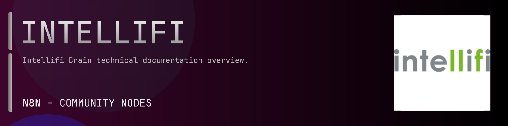

# @n8n-dev/n8n-nodes-intellifi



[](https://www.npmjs.com/package/@n8n-dev/n8n-nodes-intellifi)
[](https://opensource.org/licenses/MIT)

---

**Stop writing intellifi API integrations by hand.**

Every time you connect n8n to intellifi, you waste hours mapping endpoints, defining parameters, and debugging schemas. You copy-paste from docs, fix edge cases, and pray nothing breaks.

**What if connecting n8n to intellifi took 5 minutes, not half a day?**

This node gives you **15+ resources** out of the box: **Authinfo**, **Blobs**, **Events**, **Items**, **Keys**, and 10 more: with full CRUD operations, typed parameters, and zero manual configuration.

---

## What You Get

- **Zero boilerplate**: Resources, operations, and fields are pre-configured and ready to use
- **Full CRUD**: Create, read, update, and delete support where the API allows it
- **Typed parameters**: No more guessing field types
- **Built-in auth**: API key authentication, ready to go
- **Declarative**: Native n8n performance, no custom execute() overhead

---

## Install

```bash
npm install @n8n-dev/n8n-nodes-intellifi
```

**Or in n8n:**
1. **Settings → Community Nodes → Install**
2. Search: `@n8n-dev/n8n-nodes-intellifi`
3. Click **Install**

---

## Quick Start

1. Install the node (above)
2. Add credentials: **intellifi API** → paste your API key
3. Drag the **intellifi** node into your workflow
4. Pick a resource → pick an operation → done.

That's it. No configuration files. No code. It just works.

---

## Resources

<details>
<summary><b>Authinfo</b> (1 operations)</summary>

- Get Authentication information

</details>

<details>
<summary><b>Blobs</b> (6 operations)</summary>

- Get all binary large objects blob
- Post Create binary large object blob metadata
- Delete binary large object blob
- Get binary large object blob
- Get Download a binary large object blob
- Post Create binary large object blob

</details>

<details>
<summary><b>Events</b> (2 operations)</summary>

- Get all events
- Get event

</details>

<details>
<summary><b>Items</b> (5 operations)</summary>

- Get all items
- Post Create item
- Delete item
- Get item
- Put Update existing item

</details>

<details>
<summary><b>Keys</b> (5 operations)</summary>

- Get all keys
- Post Create key
- Delete key
- Get key
- Put Update existing key

</details>

<details>
<summary><b>Kvpairs</b> (5 operations)</summary>

- Get all key value pairs
- Post Create key value pair
- Delete key value pair
- Get key value pair
- Put Update existing Key value pair

</details>

<details>
<summary><b>Locations</b> (5 operations)</summary>

- Get all locations
- Post Create location
- Delete location
- Get location
- Put Update existing location

</details>

<details>
<summary><b>Locationrules</b> (5 operations)</summary>

- Get all location rules
- Post Create location rule
- Delete location rule
- Get location rule
- Put Update existing location rule

</details>

<details>
<summary><b>Presences</b> (2 operations)</summary>

- Get all presences
- Get presence

</details>

<details>
<summary><b>Services</b> (3 operations)</summary>

- Get all services
- Get service
- Put Update existing service

</details>

<details>
<summary><b>Sets</b> (16 operations)</summary>

- Get all item lists
- Post Create item list
- Delete item list
- Get item list
- Put Update existing item list
- Get item ids for this list
- Post Add items to an existing list
- Delete item from list
- Get all spot lists
- Post Create spot list
- Delete spot list
- Get Info for a specific spot list
- Put Update existing spot list
- Get spot ids for this list
- Post Add spots to an existing list
- Delete spot from list

</details>

<details>
<summary><b>Spots</b> (7 operations)</summary>

- Get all spots
- Get spot
- Put Update existing spot
- Get spotsets
- Post Create spotset
- Get spotset
- Put Update existing spotset

</details>

<details>
<summary><b>Spotsets</b> (3 operations)</summary>

- Get spotsets
- Post Create spotset
- Put Update existing spotset

</details>

<details>
<summary><b>Subscriptions</b> (6 operations)</summary>

- Get all subscriptions
- Post Create subscription
- Delete subscription
- Get subscription
- Put Update existing subscription
- Get subscription events

</details>

<details>
<summary><b>Users</b> (5 operations)</summary>

- Get all users
- Post Create user
- Delete user
- Get user
- Put Update existing user

</details>

---

## Why This Node?

**Without this node:**
- Hours of manual API integration
- Copy-pasting from intellifi docs
- Debugging auth, pagination, error handling
- Maintaining your own client code

**With this node:**
- Install → configure → use. 5 minutes.
- Auto-generated from the official intellifi OpenAPI spec
- Always up to date when the API changes
- Native n8n performance

---

## Auto-Generated
This node was auto-generated from the official **intellifi** OpenAPI specification using
[@n8n-dev/n8n-openapi-node-ultimate](https://github.com/kelvinzer0/n8n-openapi-node-ultimate),
then validated against the live API so you get accurate types and real parameters, not guesswork.

When the intellifi API updates, this node updates too.

---

## Support This Project

If this node saved you hours of work, consider supporting continued development, new APIs, better error handling, and faster updates.

[](https://n8n-code.github.io/membership/#/eyJ0aXRsZSI6IktlZXAgSXQgTW92aW5nIiwiZGVzYyI6Ik9uZSBkZXZlbG9wZXIgYnVpbHQgYSB0b29sIHRoYXQgYXV0by1nZW5lcmF0ZXNcbm44biBub2RlcyBmcm9tIGFueSBPcGVuQVBJIHNwZWMuXG5cbllvdXIgZG9uYXRpb24gZnVuZHMgbmV3IGZlYXR1cmVzLCBtb3JlIEFQSSBzdXBwb3J0LFxuYW5kIGJldHRlciB0b29saW5nIGZvciBldmVyeSBkZXZlbG9wZXIgYWZ0ZXIgeW91LiIsInRhcmdldCI6NTAwMCwiYWRkcmVzc2VzIjp7ImV0aGVyZXVtIjoiMHhmMDU1NWQ0MGRiRkI0ZTNCZjA3MDQ0MjgyQjc4RjJmRTFmNTFFZjcyIiwic29sYW5hIjoiNlpEVk5BYmpZZExEcXo4cGt3VUNHYllaNVV3QlFranB0QzU1Wk5vTFcybVUifSwiZGlzY29yZCI6Imh0dHBzOi8vZGlzY29yZC5nZy9wdERaOGU0aDkzIn0)

---

## License

MIT © [kelvinzer0](https://github.com/n8n-code)
